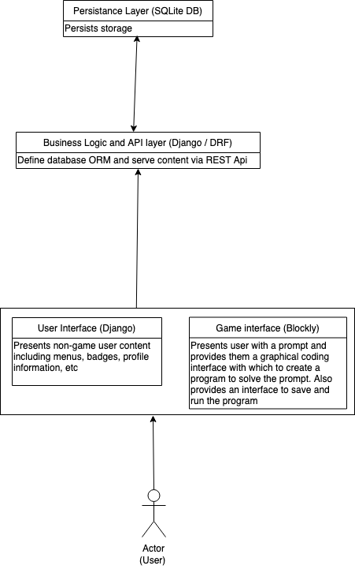
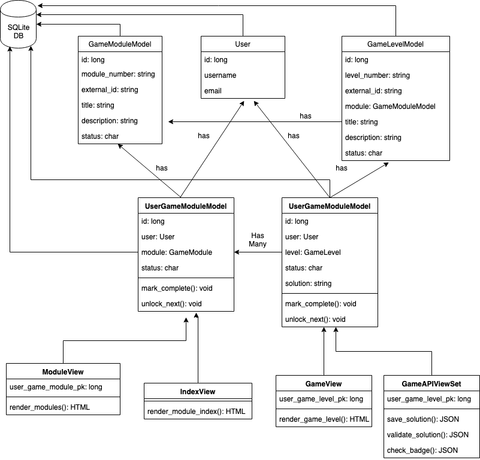
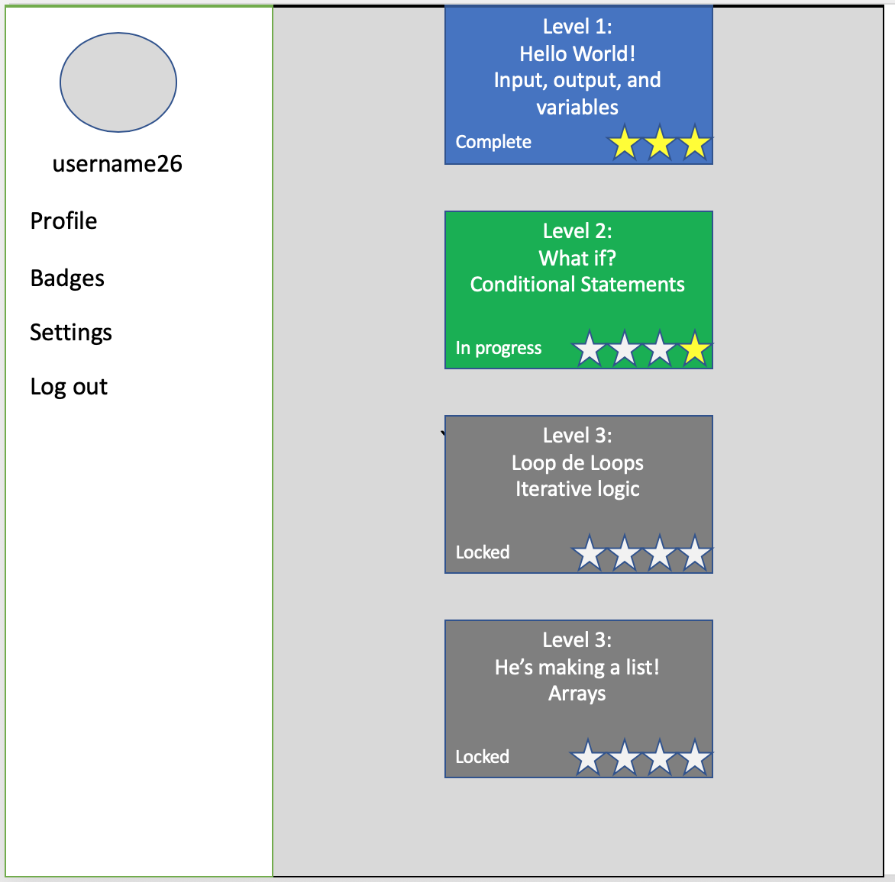
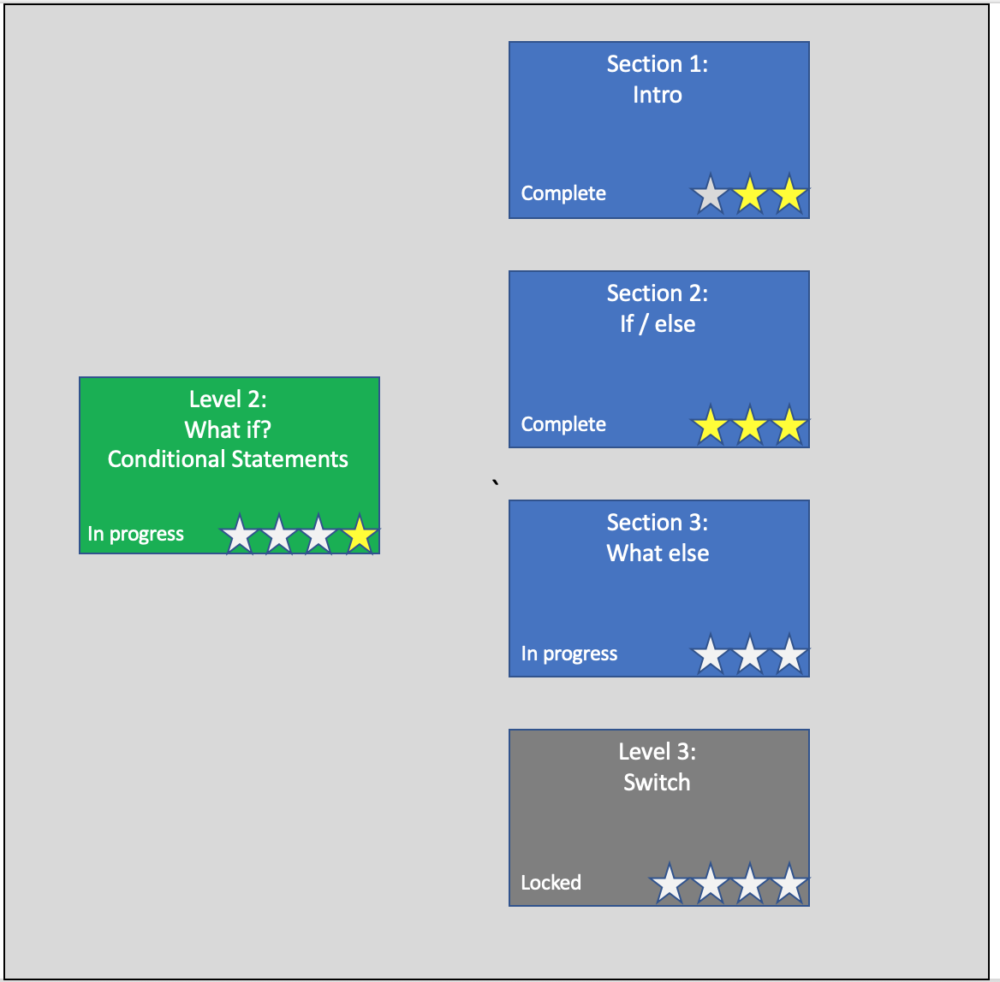
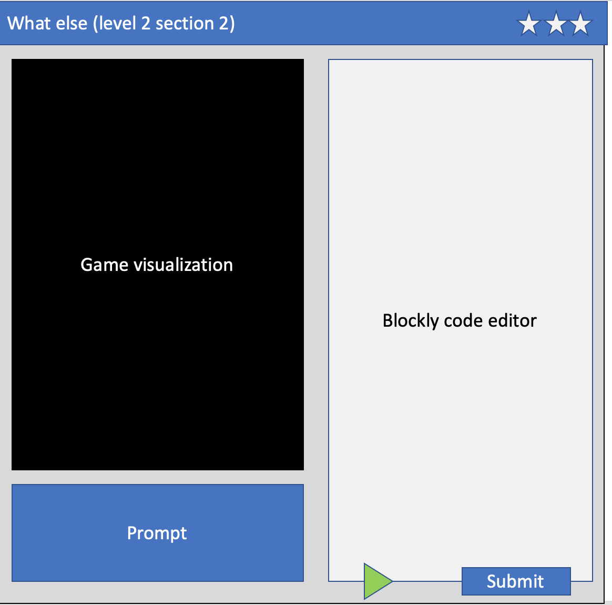

# Design Document

## Professor CS

## 1 Design Considerations

### 1.1 Assumptions

- In this project we will build a web based game which teaches fundamental computer science concepts. 
- The application's frontend and user interface will be developed in React and the games will be developed using the 
- The server side (business logic layer) will be written in Python using the Django Framework and the Django REST Framework. 
- The persistence layer will be implemented in SQLite with an ORM supported by Django.

### 1.2 Constraints

-The game system is designed for a personal computer or laptop and can run on all majors internet browsers- Firefox, Chrome and Internet Explorer
-The game will only be offered in the English language.
-Storage will be limited and will only contain a user's active session

### 1.3 System Environment

- Hardware: Windows PC or MacBook  
- Software: Firefox, Chrome or IE

## 2 Architectural Design

The architecture design depicts a high-level overview of the game-based learning application- Professor CS.

### 2.1 Component Diagram

The component diagram shows the specific technologies used to make up the Professor CS tech stack.

### 2.2 Deployment Diagram

The deployment diagram displays how the application goes from code to production on a website. Furthermore, the diagram shows how the application connects to its storage instance.

![Deployment Diagram]

## 3 Low-Level Design

### 3.1 Class Diagram

## 4 User Interface Design

The user interface diagram shows the team's initial idea for the layout of Professor CS.

